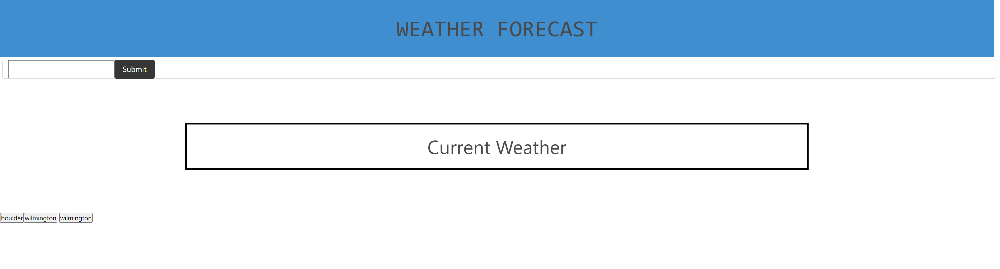

# <u>**Week 6 Challenge**</u>
This weeks challenge focused on our abilities to utilize APIs to get information for our users. 

## Deployed Webpage
[Click me to go to see my Weather Dashboard!](https://tylerwalton.github.io/weather-dashboard/)

## <u>**Motivation**</u>
Here is a list of my motivations for this project!

- learn how to properly use functions for each specific task we need accomplished
- learn to fetch an API key
- use jquery and bulma to simplify my JS and CSS
- utilizing the console log to help me troubleshoot my coding mistakes
 

## <u>**Screenshots**</u>

## <u>**Author**</u>

Tyler Walton  
Tylerwalton300@gmail.com